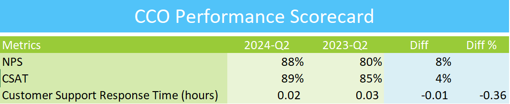

## CCO EXCEL PERFORMANCE SCORECARD

## Overview
This repository contains the Excel Performance Scorecard designed for the Chief Customer Experience Officer (CCO). It provides key performance indicators (KPIs) and metrics to monitor and improve customer experience across various touchpoints.

## Features
- Comprehensive dashboard to track customer experience metrics
- Visual representation of customer satisfaction, retention, and engagement
- Performance trends over time
- Easy-to-use format for CCOs and executives

## How to Use
1. Download the Excel file from this repository.
2. Open the file in Microsoft Excel or a compatible spreadsheet program.
3. Input relevant customer experience data in the designated sections.
4. Review the automatically generated performance scorecard for insights and trends.

## Contributing
If you wish to contribute to the project, feel free to submit a pull request with your proposed changes.

## Contact
For any questions or feedback, please contact me at goelsanchit29@gmail.com.
