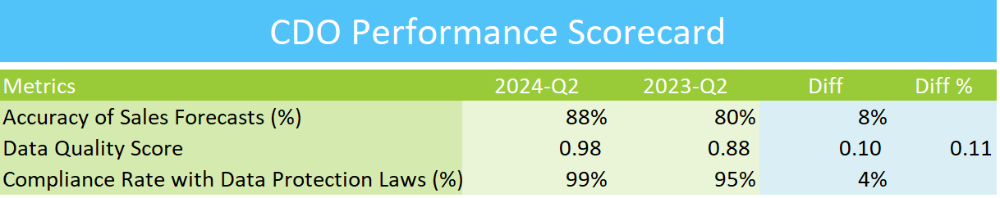

## CDO EXCEL PERFORMANCE SCORECARD

## Project Overview
This repository contains an Excel-based performance scorecard designed for Chief Data Officers (CDOs) to track and assess the effectiveness of data strategies and operations.

## Features
- Track key performance indicators (KPIs) related to data management.
- Analyze data performance metrics and identify areas for improvement.
- Generate visual reports and summaries for easy insights.

## Tools Used
- Microsoft Excel

## Usage
1. Download the Excel file from the repository.
2. Input your data-related metrics and values into the appropriate fields.
3. Review the automated performance summary and charts generated.

## Contributions
Feel free to submit issues or pull requests if you want to contribute to the project.

