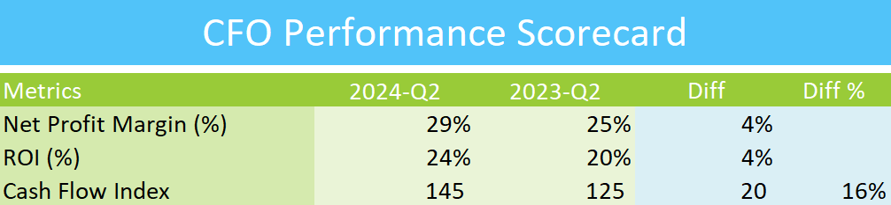

## CFO EXCEL PERFORMANCE SCORECARD

## Overview
This repository contains the Excel Performance Scorecard designed for the Chief Financial Officer (CFO). It provides key performance indicators (KPIs) and metrics to monitor and improve financial performance across various departments.

## Features
- Comprehensive dashboard to track financial performance metrics
- Visual representation of key metrics, including revenue, expenses, profitability, and cash flow
- Performance trends over time for informed financial decision-making
- Easy-to-use format for CFOs and finance executives

## How to Use
1. Download the Excel file from this repository.
2. Open the file in Microsoft Excel or a compatible spreadsheet program.
3. Input relevant financial data in the designated sections.
4. Review the automatically generated performance scorecard for insights and trends.

## Contributing
If you wish to contribute to the project, feel free to submit a pull request with your proposed changes.

## Contact
For any questions or feedback, please contact me at goelsanchit29@gmail.com.
