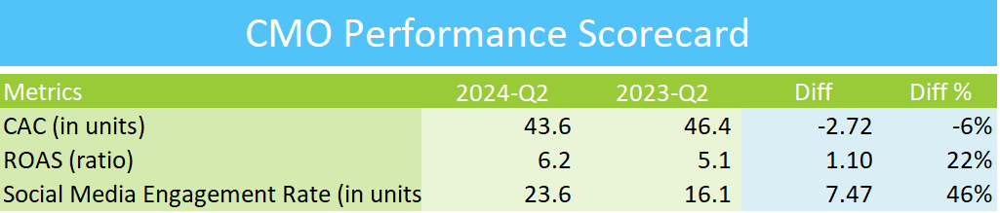

## CMO EXCEL PERFORMANCE SCORECARD

## Overview
This repository contains the Excel Performance Scorecard designed for the Chief Marketing Officer (CMO). It provides key performance indicators (KPIs) and metrics to monitor and improve marketing performance across various channels.

## Features
- Comprehensive dashboard to track marketing performance metrics
- Visual representation of key metrics, including campaign effectiveness, lead generation, and customer acquisition
- Performance trends over time for informed marketing strategies
- Easy-to-use format for CMOs and marketing executives

## How to Use
1. Download the Excel file from this repository.
2. Open the file in Microsoft Excel or a compatible spreadsheet program.
3. Input relevant marketing performance data in the designated sections.
4. Review the automatically generated performance scorecard for insights and trends.

## Contributing
If you wish to contribute to the project, feel free to submit a pull request with your proposed changes.

## Contact
For any questions or feedback, please contact me at goelsanchit29@gmail.com.
