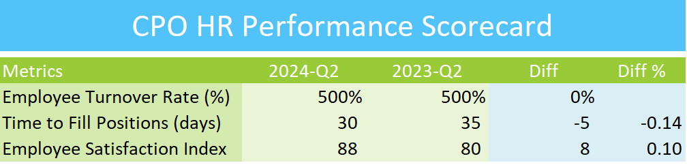

## CPOHR EXCEL PERFORMANCE SCORECARD

## Overview
This repository contains the Excel Performance Scorecard designed for the Chief People Officer (CPO). It provides key performance indicators (KPIs) and metrics to monitor and improve employee engagement, retention, and overall workforce performance across various departments.

## Features
- Comprehensive dashboard to track organizational people metrics
- Visual representation of key metrics, including employee satisfaction, retention rates, and talent development
- Performance trends over time for informed decision-making in human resources
- Easy-to-use format for CPOs and executives

## How to Use
1. Download the Excel file from this repository.
2. Open the file in Microsoft Excel or a compatible spreadsheet program.
3. Input relevant employee performance data in the designated sections.
4. Review the automatically generated performance scorecard for insights and trends.

## Contributing
If you wish to contribute to the project, feel free to submit a pull request with your proposed changes.

## Contact
For any questions or feedback, please contact me at goelsanchit29@gmail.com.
