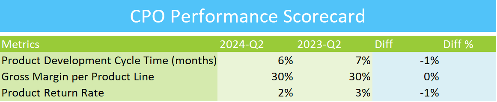

## CPO EXCEL PERFORMANCE SCORECARD

## Overview
This repository contains the Excel Performance Scorecard designed for the Chief Product Officer (CPO). It provides key performance indicators (KPIs) and metrics to monitor and improve product performance across various stages of the product lifecycle.

## Features
- Comprehensive dashboard to track product performance metrics
- Visual representation of key metrics, including product adoption, customer feedback, and market trends
- Performance trends over time for data-driven decision-making
- Easy-to-use format for CPOs and product teams

## How to Use
1. Download the Excel file from this repository.
2. Open the file in Microsoft Excel or a compatible spreadsheet program.
3. Input relevant product performance data in the designated sections.
4. Review the automatically generated performance scorecard for insights and trends.

## Contributing
If you wish to contribute to the project, feel free to submit a pull request with your proposed changes.

## Contact
For any questions or feedback, please contact me at goelsanchit29@gmail.com.
