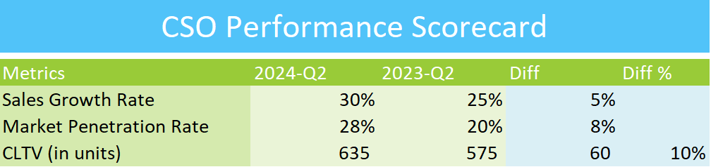

## CSO EXCEL PERFORMANCE SCORECARD

## Overview
This repository contains the Excel Performance Scorecard designed for the Chief Sales Officer (CSO). It provides key performance indicators (KPIs) and metrics to monitor and improve overall sales performance across various teams and channels.

## Features
- Comprehensive dashboard to track sales performance metrics
- Visual representation of key metrics, including sales revenue, conversion rates, and team performance
- Performance trends over time for informed decision-making and strategy adjustments
- Easy-to-use format for CSOs and sales executives

## How to Use
1. Download the Excel file from this repository.
2. Open the file in Microsoft Excel or a compatible spreadsheet program.
3. Input relevant sales performance data in the designated sections.
4. Review the automatically generated performance scorecard for insights and trends.

## Contributing
If you wish to contribute to the project, feel free to submit a pull request with your proposed changes.

## Contact
For any questions or feedback, please contact me at goelsanchit29@gmail.com.
