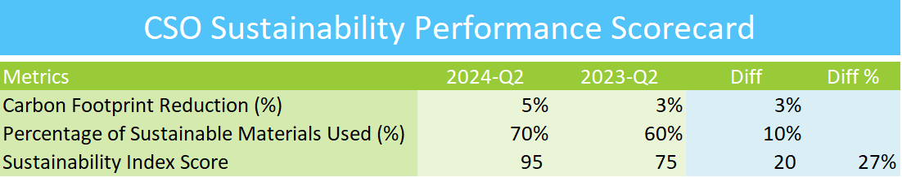

## CSO SUSTAINABILITY EXCEL PERFORMANCE SCORECARD

## Overview
This repository contains the Excel Performance Scorecard designed for the Chief Sustainability Officer (CSO). It provides key performance indicators (KPIs) and metrics to monitor and enhance sustainability initiatives across various business operations.

## Features
- Comprehensive dashboard to track sustainability performance metrics
- Visual representation of key metrics, including carbon footprint, resource efficiency, and waste management
- Performance trends over time for informed decision-making on sustainability practices
- Easy-to-use format for CSOs and executives

## How to Use
1. Download the Excel file from this repository.
2. Open the file in Microsoft Excel or a compatible spreadsheet program.
3. Input relevant sustainability data in the designated sections.
4. Review the automatically generated performance scorecard for insights and trends.

## Contributing
If you wish to contribute to the project, feel free to submit a pull request with your proposed changes.

## Contact
For any questions or feedback, please contact me at goelsanchit29@gmail.com.
