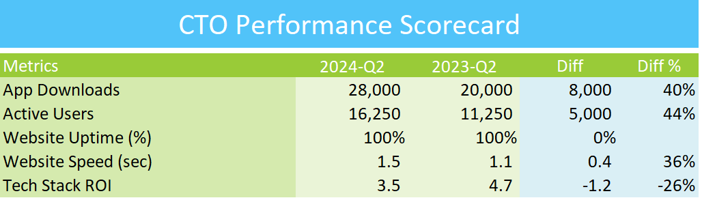

## CTO EXCEL PERFORMANCE SCORECARD

## Overview
This repository contains the Excel Performance Scorecard designed for the Chief Technology Officer (CTO). It provides key performance indicators (KPIs) and metrics to monitor and improve technology performance and innovation across various teams.

## Features
- Comprehensive dashboard to track technology performance metrics
- Visual representation of key metrics, including project timelines, resource allocation, and team productivity
- Performance trends over time for strategic technology decision-making
- Easy-to-use format for CTOs and technology executives

## How to Use
1. Download the Excel file from this repository.
2. Open the file in Microsoft Excel or a compatible spreadsheet program.
3. Input relevant technology performance data in the designated sections.
4. Review the automatically generated performance scorecard for insights and trends.

## Contributing
If you wish to contribute to the project, feel free to submit a pull request with your proposed changes.

## Contact
For any questions or feedback, please contact me at goelsanchit29@gmail.com.
